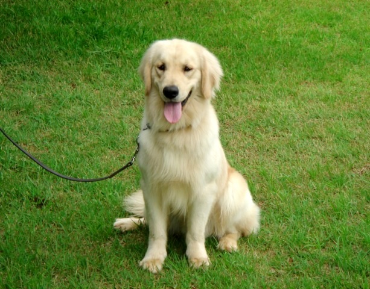

#Ubuntu 14.04にcaffeをインストール
##基本的に以下のURLを参照
参考サイトにもあるようにUbuntu 14.04の最新版（その時点でのバージョンアップはすべて更新済みの状態）で確認しています．

>Github  
>Ubuntu 14.04 VirtualBox VM  
>[https://github.com/BVLC/caffe/wiki/Ubuntu-14.04-VirtualBox-VM](https://github.com/BVLC/caffe/wiki/Ubuntu-14.04-VirtualBox-VM)

##前準備

ビルドに必要な最初のパッケージ群

```bash
sudo apt-get install build-essential
```

依存関係で必要なパッケージをインストール

```bash
sudo apt-get install -y libprotobuf-dev libleveldb-dev libsnappy-dev libopencv-dev libboost-all-dev libhdf5-serial-dev protobuf-compiler gfortran libjpeg62 libfreeimage-dev libatlas-base-dev git python-dev python-pip libgoogle-glog-dev libbz2-dev libxml2-dev libxslt-dev libffi-dev libssl-dev libgflags-dev liblmdb-dev python-yaml
```

```bash
sudo easy_install pillow
```

##本家レポジトリからClone
プログラムをダウンロードしてくる場所で以下を実行

```bash
git clone https://github.com/BVLC/caffe.git
cd caffe
```

Python caffeを実行するために必要なパッケージをインストール．
ディレクトリは先ほど`cd`した`caffe`で行う．

```bash
cat python/requirements.txt | xargs -L 1 sudo pip install
```

シンボリックリンクを作成

```bash
sudo ln -s /usr/include/python2.7/ /usr/local/include/python2.7
sudo ln -s /usr/local/lib/python2.7/dist-packages/numpy/core/include/numpy/ /usr/local/include/python2.7/numpy
```

Makefile.configを作成し，Geditで編集する

```bash
cp Makefile.config.example Makefile.config
gedit Makefile.config
```

8行目の`#`を外して

```bash
## Refer to http://caffe.berkeleyvision.org/installation.html
# Contributions simplifying and improving our build system are welcome!

# cuDNN acceleration switch (uncomment to build with cuDNN).
# USE_CUDNN := 1

# CPU-only switch (uncomment to build without GPU support).
# CPU_ONLY := 1
```

以下のようにする．

```bash
CPU_ONLY := 1
```

また52行目を以下のように編集．これを

```bash
# NOTE: this is required only if you will compile the python interface.
# We need to be able to find Python.h and numpy/arrayobject.h.
PYTHON_INCLUDE := /usr/include/python2.7 \
    /usr/lib/python2.7/dist-packages/numpy/core/include
```

以下に変更． `/local`を追加

```bash
# NOTE: this is required only if you will compile the python interface.
# We need to be able to find Python.h and numpy/arrayobject.h.
PYTHON_INCLUDE := /usr/include/python2.7 \
    /usr/local/lib/python2.7/dist-packages/numpy/core/include
```

##caffeをコンパイル

```bash
make pycaffe
make all
make test
```

##ImageNet Caffe modelとlabelsのダウンロード

```bash
./scripts/download_model_binary.py models/bvlc_reference_caffenet
./data/ilsvrc12/get_ilsvrc_aux.sh
```

##サンプルプログラムのエラー処理
このままサンプルを実行すると，以下のようなエラーが．

```bash
I0615 15:54:24.737364 17294 upgrade_proto.cpp:626] Successfully upgraded file specified using deprecated V1LayerParameter
Traceback (most recent call last):
  File "python/classify.py", line 138, in <module>
    main(sys.argv)
  File "python/classify.py", line 110, in main
    channel_swap=channel_swap)
  File "/home/ry0/caffe/python/caffe/classifier.py", line 34, in __init__
    self.transformer.set_mean(in_, mean)
  File "/home/ry0/caffe/python/caffe/io.py", line 255, in set_mean
    raise ValueError('Mean shape incompatible with input shape.')
ValueError: Mean shape incompatible with input shape.
```

参考サイト
> Qiita  
>OSX10.10でCaffeをインストール、リファレンスモデルで画像を分類  
>http://qiita.com/Bonnnou_108/items/41e6dadeff1310b4eb5d#classifypy%E3%82%92%E4%BD%BF%E7%94%A8%E3%81%97%E3%81%A6%E7%94%BB%E5%83%8F%E5%88%86%E9%A1%9E


ここにあるように`python/caffe/io.py`の255行目を編集する．

```python
if ms != self.inputs[in_][1:]:
    raise ValueError('Mean shape incompatible with input shape.')
```

```python
if ms != self.inputs[in_][1:]:
    print(self.inputs[in_])
    in_shape = self.inputs[in_][1:]
    m_min, m_max = mean.min(), mean.max()
    normal_mean = (mean - m_min) / (m_max - m_min)
    mean = resize_image(normal_mean.transpose((1,2,0)),in_shape[1:]).transpose((2,0,1)) * (m_max - m_min) + m_min
    #raise ValueError('Mean shape incompatible with input shape.')
```

##サンプルを実行するための準備
以下のコードを`show_result.py`として`caffe/python/`に保存．ファイルはこのレポジトリにある[show_result.py](https://github.com/Nishida-Lab/lec_caffe/blob/master/show_result.py)でもいいです．  
このソースコードは[http://techblog.yahoo.co.jp/programming/caffe-intro/](http://techblog.yahoo.co.jp/programming/caffe-intro/)から拝借しました．

```python
#! /usr/bin/env python
# -*- coding: utf-8 -*-
import sys, numpy

categories = numpy.loadtxt(sys.argv[1], str, delimiter="\t")
scores = numpy.load(sys.argv[2])
top_k = 3
prediction = zip(scores[0].tolist(), categories)
prediction.sort(cmp=lambda x, y: cmp(x[0], y[0]), reverse=True)
for rank, (score, name) in enumerate(prediction[:top_k], start=1):
    print('#%d | %s | %4.1f%%' % (rank, name, score * 100))
```

##いよいよ実行
かわいいわんちゃんをcaffeにかけてみます．この写真を保存するか，以下のコマンドのようにネット上にある画像を指定してもよい．

  


```bash
cd python
python classify.py --raw_scale 255 https://raw.githubusercontent.com/Nishida-Lab/lec_caffe/master/golden.jpg ./result.npy
python show_result.py ../data/ilsvrc12/synset_words.txt result.npy
```

もしも，

```bash
...
...
ImportError: No module named skimage.io
```

のようなエラーが出た場合には以下のコマンドを実行してみてください．

```bash
sudo apt-get install python-skimage
```

これをすべて実行すると，以下のように結果が出力される．

```bash
#1 | n02099601 golden retriever | 93.5%
#2 | n02099712 Labrador retriever |  4.5%
#3 | n02111500 Great Pyrenees |  1.0%
```

ゴールデンレトリバーが93.5%，ラブラドールレトリバーが4.5%と高い割合でcaffeは判断してます！  
おわりです！
